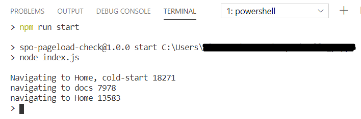

# Introduction

This utility checks page load performance in SharePoint Online.


# Using the utility

You should have nodejs 8 or higher.

## First use

On the first user install the packages:

```
npm install
```

Also rename the [`.env.example`](.env.example) to `.env` and provide your values.

## Start the utility

Just run:

```
npm run start
```

# Known limitations

This utility does not support Multi Factor Authentication.

# Used tools

- node-sp-auth
- dotenv
- puppeteer

# Contributing

Contributions are appreciated. I would like to get more data from page loads. I also would like to provide to store results.
